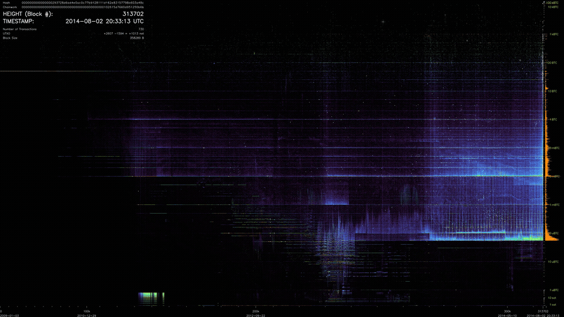
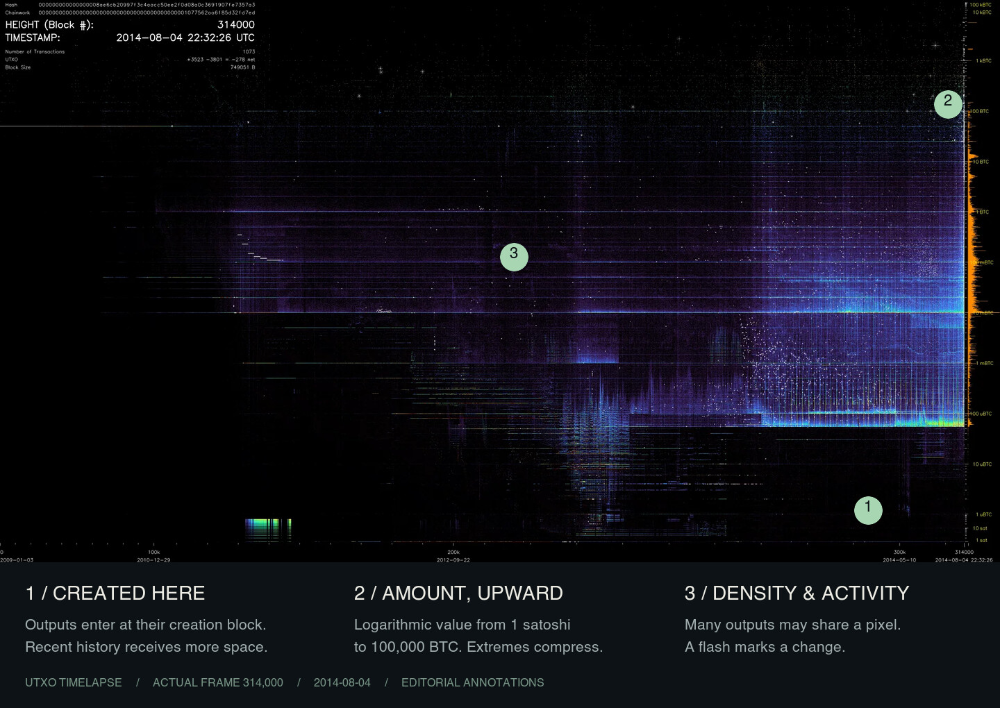
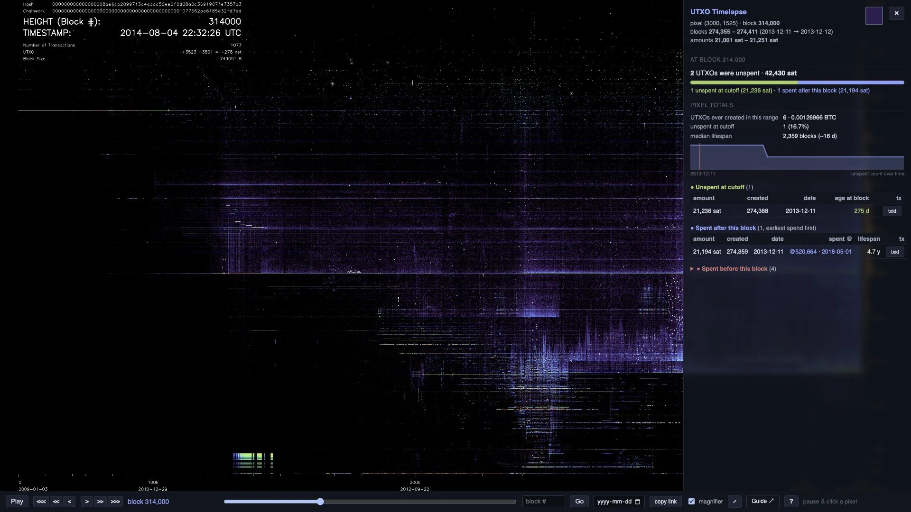
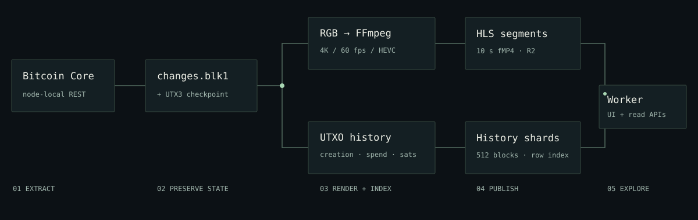

<div align="center">

# UTXO Timelapse

### Bitcoin's history, written in unspent outputs.

An evolving landscape of creation, survival and spending.<br>
Explore 966,361 blocks in a 4K film. Pause any moment and inspect the outputs behind a pixel.

**[Read the illustrated guide](https://nostitos.github.io/utxo-timelapse/)** · **[Open the explorer](https://utxo.aiception.ai/)** · **[Under the hood](https://nostitos.github.io/utxo-timelapse/technical.html)**

[](https://nostitos.github.io/utxo-timelapse/)

**4K · 60 fps · 4h 28m · 3.65 billion historical output records**<br>
Published data: genesis through block **966,360**, September 10, 2026.

</div>

## Learn to read the landscape

An output appears at its **creation block** on the horizontal axis and its **amount** on the vertical axis. It stays there until spent. Many outputs can share a pixel. Colour represents accumulated density, weighted by value in this edition; a flash marks activity.

The newest 105,000-block epoch receives half the plot. Older epochs compress geometrically, with a 120-block slide at each layout change. Time is deliberately uneven: the present gets room while the past remains visible.

[](https://nostitos.github.io/utxo-timelapse/#reading)

The **[visual guide](https://nostitos.github.io/utxo-timelapse/)** walks through the axes, two palettes, eras, whale flashes and explorer controls with real frames, short films, enlarged crops and an interactive time-axis demonstration.

## Go from a picture to evidence

[](https://utxo.aiception.ai/?block=314000&x=3000&y=1525)

**[Open this exact view](https://utxo.aiception.ai/?block=314000&x=3000&y=1525).** At block 314,000, this pixel contains two unspent outputs. One remains unspent at the published cutoff; the other was spent in 2018. The drawer shows amounts, dates, population over time and candidate transaction matches.

- Pause, magnify and inspect native image pixels.
- Jump by block or UTC date; step through individual frames.
- Separate outputs still unspent at the cutoff from those spent later or earlier.
- Share a block-and-pixel link; resolve candidate transaction IDs when needed.

The high-detail explorer targets desktop browsers with HEVC support. The guide's lighter previews work independently of the full film.

## What this edition changes

UTXO Timelapse builds on Martinus's original idea with a substantially expanded rendering and exploration system.

| Area | Implemented here |
|---|---|
| Time | Four axis modes, normalized geometric epochs and smooth boundary slides |
| Accounting | Double-precision density, exact remapping from an alive ledger, matching inverse pixel queries |
| Colour & activity | Amount-weighted density, actual-value flashes, a white-hot tail above 10 BTC, compressed extreme-value bands |
| Data | Creation-height-preserving v3 checkpoints, zero-value accounting, full historical lifecycle index and incremental updates |
| Exploration | Magnifier, historical pixel drawer, dates, block stepping, lifecycle charts, transaction matching and share links |
| Delivery | HEVC 4:4:4 film, segmented HLS, private R2 storage, Workers, indexed shards and later-spend patches |
| Updates | Verified prefix-preserving video append, continuous HLS timestamps and coordinated release metadata |

These choices have costs. Weighted colour is not a raw output count. Compressed time changes horizontal scale. Lossy previews can hide tiny points. The compact history does not retain full outpoints, so equal-amount transaction matches can be ambiguous. The **[technical reference](https://nostitos.github.io/utxo-timelapse/technical.html)** documents the formats, algorithms, API, all **42 settings**, measured release evidence and **20 tradeoffs**.

## Build your own

```sh
git clone --recurse-submodules https://github.com/nostitos/utxo-timelapse.git
cd utxo-timelapse
cmake -S . -B build -DCMAKE_BUILD_TYPE=Release
cmake --build build --parallel
./build/buv -ns '-tc=density_palette,epoch_transition_mapping,checkpoint_v3'
```

Requires a C++17 compiler, CMake, OpenCV and TBB. FFmpeg encodes the frames. Bitcoin Core and substantial storage/memory are needed to create your own dataset; generated chain files and the full video are not in Git. On macOS, see the tested build flags and test-suite caveat in **[the operations index](docs/README.md)**.



| Where to go | What you will find |
|---|---|
| [Illustrated guide](https://nostitos.github.io/utxo-timelapse/) | Learn the image, watch eras unfold, explore real screenshots |
| [Technical reference](https://nostitos.github.io/utxo-timelapse/technical.html) | Data formats, rendering math, settings, API and tradeoffs |
| [Operations index](docs/README.md) | Build, extract, render, update and publish |
| [Vocabulary](GLOSSARY.md) | Canonical terms tied to code |
| [September 10 release report](docs/video-update-2026-09-10.md) | Timings, retained bytes and verification evidence |
| [Cloud service](cloudflare/utxo-video-worker/README.md) | HLS, history shards, releases and deployment |
| [Guide source & media](site/README.md) | Static site, reproducible previews and provenance |

## Origin & credit

**[Martinus's BitcoinUtxoVisualizer](https://github.com/martinus/BitcoinUtxoVisualizer)** supplied the original visualization concept and code foundation. That inspiration deserves clear credit. UTXO Timelapse is maintained by **[nostitos](https://github.com/nostitos)** and has its own visual direction, accounting model, explorer, cloud delivery and update workflow.

The original [MIT license and copyright](LICENSE) are preserved. The guide labels the upstream images used in its origin comparison. Dependencies and font/media licenses are listed in the [technical credits](https://nostitos.github.io/utxo-timelapse/technical.html#credits).
